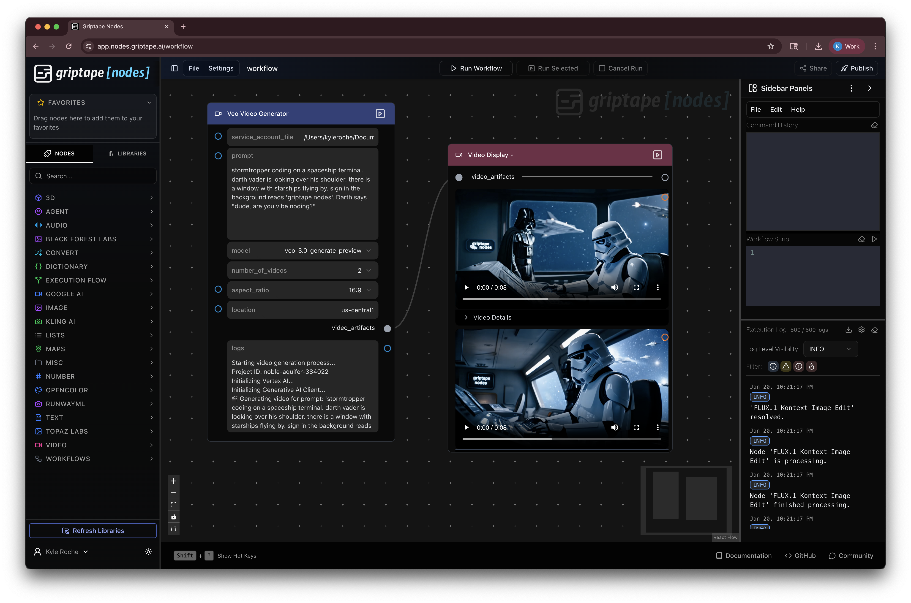

# Griptape Nodes: Google AI Library

This library provides Griptape Nodes for interacting with Google AI services, including the powerful Veo video generation model.

## Features

- **Veo Video Generator**: Generate high-quality videos from text prompts using Google's state-of-the-art Veo model.
- **Video Display**: A dynamic node that displays video players for generated videos directly in the Griptape Nodes UI.

---

## 1. Authentication

This library supports two methods for authenticating with Google Cloud.

### Method 1: Service Account File (Recommended for Servers)
This is the most explicit and secure method for production or automated workflows.

1.  **Create a Service Account and Key**: Follow the steps below to create a service account with the **Vertex AI User** role and download its JSON key file.
2.  **Provide the Path**: In the `Veo Video Generator` node, provide the full, absolute path to this JSON file in the `service_account_file` parameter. The node will use this specific identity to authenticate.

### Method 2: Application Default Credentials (Recommended for Local Development)
This method is convenient for local development and testing, as it uses the credentials from your local `gcloud` CLI.

1.  **Install the `gcloud` CLI**: If you haven't already, [install the Google Cloud CLI](https://cloud.google.com/sdk/docs/install).
2.  **Log in**: Run the following command in your terminal. This will open a browser window for you to log in with your Google account.
    ```bash
    gcloud auth login
    ```
3.  **Set your project**: Configure the `gcloud` CLI to use your target project.
    ```bash
    gcloud config set project YOUR_PROJECT_ID
    ```
4.  **Use the Node**:
    -   Leave the `service_account_file` parameter **empty**.
    -   Fill in the `project_id` parameter with your Google Cloud Project ID.
    -   The node will automatically detect and use your logged-in `gcloud` identity.

---

## 2. Setup & Configuration

### Step 1: Create a Service Account and Key (for Method 1)

1.  **Go to the Google Cloud Console**: Navigate to [IAM & Admin > Service Accounts](https://console.cloud.google.com/iam-admin/serviceaccounts).
2.  **Select your project** from the dropdown at the top of the page.
3.  Click **+ CREATE SERVICE ACCOUNT**.
4.  Give the service account a **Name** (e.g., `griptape-veo-generator`) and an optional description, then click **CREATE AND CONTINUE**.
5.  **Grant access**: In the "Grant this service account access to project" step, click the **Role** field and search for and select the **Vertex AI User** role. This provides the necessary permissions to run AI Platform jobs. Click **CONTINUE**.
6.  Click **DONE** to finish creating the service account.
7.  **Create a key**: You will be returned to the list of service accounts. Find the one you just created and click on it.
8.  Go to the **KEYS** tab.
9.  Click **ADD KEY** and select **Create new key**.
10. Choose **JSON** as the key type and click **CREATE**. A JSON file will be downloaded to your computer. This is your credentials file.

### Step 2: Enable the Vertex AI API

1.  **Go to the API Library**: Navigate to [APIs & Services > Library](https://console.cloud.google.com/apis/library).
2.  Search for **Vertex AI API**.
3.  Click on it and then click the **ENABLE** button if it is not already enabled for your project.

You are now ready to use the nodes!

---

## 3. Example Workflow

Here is an example of how to connect the nodes to generate and display videos.

1.  Add the `Veo Video Generator` node to your workflow.
2.  **Choose your authentication method**:
    -   Either provide the path to your `service_account_file` (leaving `project_id` blank).
    -   Or leave `service_account_file` blank and provide your `project_id`.
3.  Write a creative prompt.
4.  Choose the number of videos to generate.
5.  Add the `Video Display` node.
6.  Connect the `video_artifacts` output from the `Veo Video Generator` to the `video_artifacts` input of the `Video Display` node.
7.  Run the workflow! The `Video Display` node will dynamically create a video player for each generated video.



---

## 4. Nodes

### Veo Video Generator
This node is the core of the library. It takes a service account file, a text prompt, and other configuration options to generate one or more videos using the Google Veo model via the Vertex AI API. It outputs a list of video artifacts.

### Video Display
A utility node designed to visualize the output of the video generator. It accepts a list of video artifacts and dynamically creates an interactive video player for each one directly in the node's UI, complete with output ports to pass individual videos to downstream nodes.
